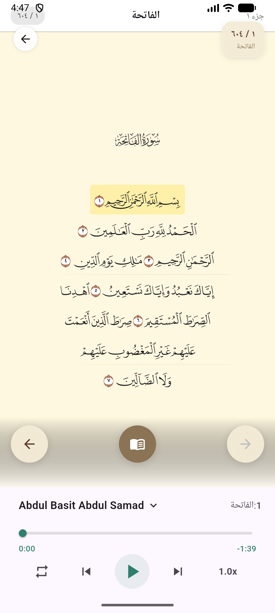
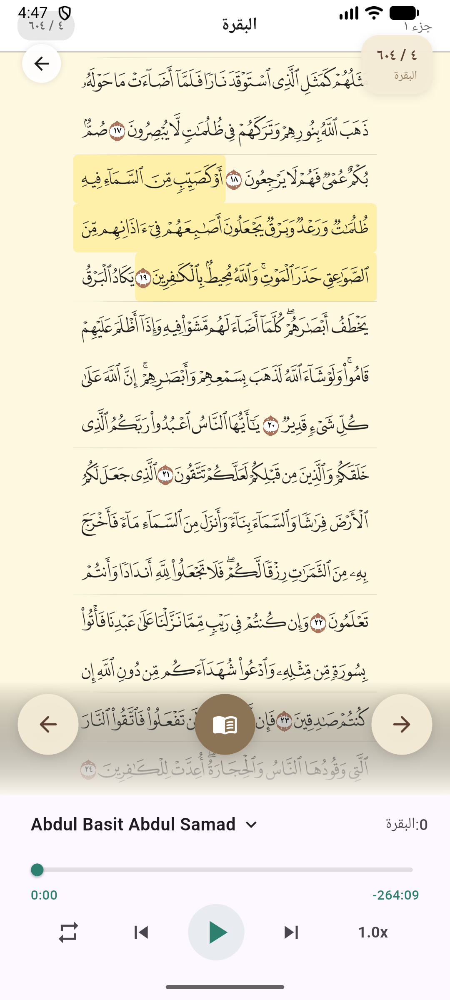
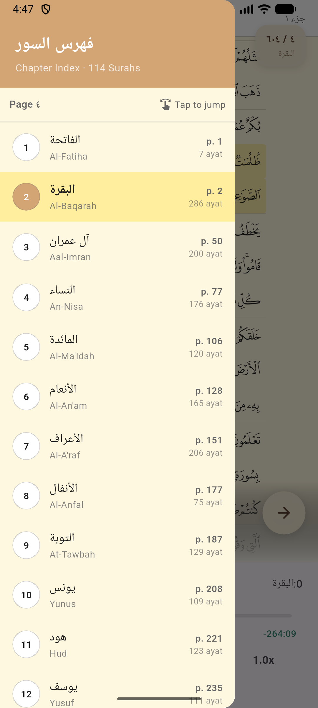
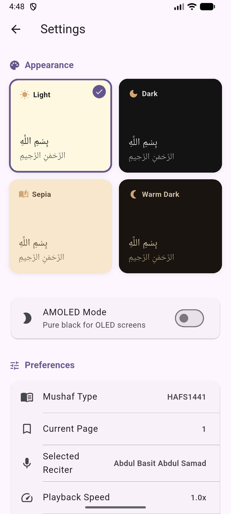

# IMAD Flutter - Mushaf Package

Add mushaf to your Flutter application easily! A fully functional, modular Quran reader library with display, bookmarks, search, offline data storage, and more.

[](https://flutter.dev)
[](https://dart.dev)
[]()

---

## 🌍 Ecosystem

This package is part of an ecosystem across all platforms:
- **iOS:** [MushafImad](https://github.com/ibo2001/MushafImad/)
- **Android:** [mushaf-imad-android](https://github.com/YahiaRagae/mushaf-imad-android/)
- **Flutter:** [mushaf-imad-flutter](https://github.com/Itqan-community/mushaf-imad-flutter) (This repository)

---

## 📸 Screenshots

<p align="center">
  
  
  
  
</p>

---

## ✨ Features

- 📖 **Full Quran Text Display** (604 pages) leveraging beautifully rendered images.
- 🎨 **Multiple Reading Themes** (Comfortable, Calm, Night, White) for optimal accessibility.
- 💾 **Offline-first Architecture** powered by [Hive](https://pub.dev/packages/hive) for user data and static Quran metadata.
- 🔍 **Unified Search Functionality** (Search Verses, Chapters, and Bookmarks).
- 🔖 **Bookmarks and Reading History** system mapping natively to UI components.
- 🏗️ **Clean Modular Architecture** with a strict separation of domain, data, and UI layers.
- 🧩 **Ready-to-use UI Components:** (`MushafPageView`, `QuranPageWidget`, `SearchPage`, `SettingsPage`, `ChapterIndexDrawer`, etc.)
- 🎵 **Audio Playback:** Includes support for offline device assets, streaming from **Quran.com**, and external streams like **Itqan CMS**.

---

## ⚙️ Requirements

- **Dart SDK**: `>= 3.11.0`
- **Flutter**: `>= 1.17.0`

---

## 🚀 Quick Start

### 1. Add Dependency

Add the package to your `pubspec.yaml`:

```yaml
dependencies:
  imad_flutter: ^0.1.0
```

### 2. Download Quran Images

> ⚠️ **Important:** The `quran-images/` directory (~9,000+ PNG files) is **not included** in the pub.dev package due to size limitations. You must download it separately from the [GitHub repository](https://github.com/Itqan-community/mushaf-imad-flutter).

```bash
# Clone or download the quran-images directory from the repo
git clone https://github.com/Itqan-community/mushaf-imad-flutter.git
# Copy quran-images into your project's package cache or use a path dependency
```

If you're using a **path dependency** (recommended during development):
```yaml
dependencies:
  imad_flutter:
    path: ../mushaf-imad-flutter  # already includes quran-images/
```

### 3. Initialization & Setup

The library uses `Hive` for its local database and requires initialization before the app runs.

```dart
import 'package:flutter/material.dart';
import 'package:imad_flutter/imad_flutter.dart';

void main() async {
  WidgetsFlutterBinding.ensureInitialized();
  
  // One-line setup! Initializes Hive, provisions Quran metadata, 
  // and injects dependencies via get_it.
  await MushafLibrary.initialize();
  
  runApp(const MyApp());
}
```

### 4. Audio Configuration (Quran.com)

The library supports two main audio sources: `local` (bundled assets) and `quranCom` (cloud streaming). To use Quran.com, provide your credentials during initialization:

```dart
await MushafLibrary.initialize(
  audioSource: MushafAudioSource.quranCom,
  quranComConfig: QuranComAudioSourceConfig(
    clientId: 'your_client_id',
    clientSecret: 'your_client_secret',
    env: QuranComEnv.production, 
  ),
);
```

> **Note:** You can obtain credentials from the [Quran.com Request Access Page](https://api-docs.quran.foundation/request-access/) _(valid for 1 hour)_.

> **Security Warning:** Do not commit your credentials to version control. Use environment variables instead.

### 5. Basic Usage (Displaying the Mushaf)

Once initialized, simply instantiate the `MushafPageView`.

```dart
import 'package:flutter/material.dart';
import 'package:imad_flutter/imad_flutter.dart';

class MushafScreen extends StatelessWidget {
  @override
  Widget build(BuildContext context) {
    return Scaffold(
      appBar: AppBar(title: Text('Mushaf')),
      // Providing a bare-minimum Theme Scope
      body: MushafThemeScope(
        notifier: ThemeViewModel()..setTheme(ReadingTheme.comfortable),
        child: MushafPageView(
          initialPage: 1, // Start at Al-Fatihah
        ),
      ),
    );
  }
}
```

---

## 🛠️ Exploring UI Components

The `imad_flutter` library provides ready-made screens and widgets for immediate integration.

### Search Functionality

The built-in unified search queries Verses, Chapters, and Bookmarks all at once:

```dart
import 'package:imad_flutter/imad_flutter.dart';

// Just navigate to the built in SearchPage!
Navigator.push(
  context,
  MaterialPageRoute(builder: (context) => const SearchPage()),
);
```

### Table of Contents / IndexDrawer

Easily access any Surah or Juz:

```dart
Scaffold(
  drawer: const ChapterIndexDrawer(), // Surah / Juz selection drawer
  body: MushafPageView(initialPage: 1),
);
```

### Theming 

You can update themes dynamically. Wrap your Mushaf pages with `MushafThemeScope`.

```dart
enum ReadingTheme {
  comfortable,  // Light green
  calm,         // Light blue
  night,        // Dark theme 
  white,        // Pure white 
}
```

---

## 🏗️ Architecture Setup & Customization

The library is strictly modular:
- **Domain Layer:** Encompasses models (e.g., `Verse`, `Chapter`, `Bookmark`) and repository abstractions.
- **Data Layer:** Utilizes `Hive` for DAOs (`HiveBookmarkDao`, `HiveReadingHistoryDao`, etc.)
- **UI Layer:** Views and ViewModels employing native `ChangeNotifier`.

All core dependencies are registered centrally via `get_it`. If you wish to use your own database engine, simply implement the abstract repository protocols and pass them manually.

```dart
MushafLibrary.initialize(
  databaseService: MyCustomDatabaseService(),
  bookmarkDao: MyCustomBookmarkDao(),
  readingHistoryDao: MyCustomReadingHistoryDao(),
  searchHistoryDao: MyCustomSearchHistoryDao(),
  // ...
);
```

### 🧩 Bringing Your Own Mushaf (MushafConfigRegistry)

The library ships with the **Hafs 1441** Mushaf built in — it is the default, requires **zero configuration**, and existing apps keep working without any changes.

If you want to support another Mushaf layout (for example **1405 Hafs**, or a future **Warsh** / **Shammarly** variant), you plug in its images through `MushafConfigRegistry` — the UI never hard-codes Mushaf logic. Every widget asks the registry for a `MushafConfig`, which resolves line images through a `MushafAssetProvider`. Register a provider once and the whole UI picks the variant up automatically.

#### 1. Provide the line images

Each Mushaf variant needs one PNG per line, named `<root>/<page>/<line>.png`, where `page` is 1-indexed (`1`–`604`) and `line` is 1-indexed (`1`–`15`):

```
<root>/1/1.png
<root>/1/2.png
...
<root>/604/15.png
```

Depending on where the images live, pick one of the two built-in providers:

```dart
import 'package:imad_flutter/imad_flutter.dart';

// Images bundled into your app/package's assets/ directory:
// assets/quran-images-1405/1/1.png, etc.
const bundled = FlutterAssetProvider(
  package: 'your_app',
  assetDirectory: 'quran-images-1405',
);

// Images downloaded from a release (e.g. GitHub Releases) and extracted
// to a local directory: /storage/quran-images-1405/1/1.png, etc.
final downloaded = FileAssetProvider(
  rootDirectory: '/storage/quran-images-1405',
);
```

#### 2. Register the provider

Call this **once**, before the Mushaf is displayed (e.g. in `main()` before `MushafLibrary.initialize()`):

```dart
MushafLibrary.registerMushafAssetProvider(
  MushafType.hafs1405,
  FileAssetProvider(rootDirectory: '/storage/quran-images-1405'),
);

// Or directly on the registry:
// MushafConfigRegistry.registerAssetProvider(
//   MushafType.hafs1405,
//   FileAssetProvider(rootDirectory: '/storage/quran-images-1405'),
// );
```

> The default `hafs1441` is always available and **cannot be overridden** — registering a provider for it is rejected with an assertion error in debug mode.

#### 3. Select the Mushaf

Once registered, pass the variant to the page view:

```dart
MushafPageView(
  initialPage: 1,
  mushafType: MushafType.hafs1405,
)
```

The default is `MushafType.hafs1441`, so existing `MushafPageView` usages are unaffected.

#### 4. Check availability

Before switching, verify the variant is usable:

```dart
if (MushafConfigRegistry.isAvailable(MushafType.hafs1405)) {
  // Safe to display hafs1405.
}
```

If a variant is used without registration, `MushafConfigRegistry.configFor(...)` throws a `StateError` explaining that `registerAssetProvider` must be called first.

> **Note on markers/highlights:** Verse markers and highlight regions are read from the bundled `quran_verse_data.json` using per-Mushaf fields (e.g. `marker1405`, `highlights1405`). If a variant has no entries in that file, pages still render normally — markers and highlights are simply skipped.

Future Mushaf variants follow the exact same pattern: add a `MushafType`, map its metadata fields in the registry, and register the asset provider in `main()`.

### 🎧 Streaming Audio via Itqan CMS

The framework allows you to easily plug into the the **Itqan CMS JSON API** (`cms.itqan.dev`) for audio playback and verse-level highlight syncing, removing the need to host MP3s locally.

Pass `ItqanAudioConfig` to `MushafLibrary.initialize` natively:

```dart
import 'package:imad_flutter/imad_flutter.dart';

void main() async {
  WidgetsFlutterBinding.ensureInitialized();
  
  // Define CMS configuration pointing to the Itqan API
  const itqanConfig = ItqanAudioConfig(
    baseUrl: 'https://api.cms.itqan.dev',
    defaultReciterId: 1, // e.g., Mishari Al-afasi
  );

  await MushafLibrary.initialize(itqanAudioConfig: itqanConfig);
  
  runApp(const MyApp());
}
```

This bypasses the `DefaultAudioRepository` and relies exclusively on `ItqanAudioRepository` which parses server-provided verse timing boundaries dynamically.

> 📚 **Detailed Guide:** For a comprehensive, step-by-step tutorial on how the audio syncing works under the hood and how to implement it, please see the [CMS Audio Integration Guide](docs/itqan_audio.md).

---

## 📝 Demo App

Navigate to the internal `example` directory to run the full presentation sample that demonstrates everything the library offers:

```bash
cd example
flutter run
```

---

## 📄 License

This project is licensed under the MIT License - see the `LICENSE` file for details.
