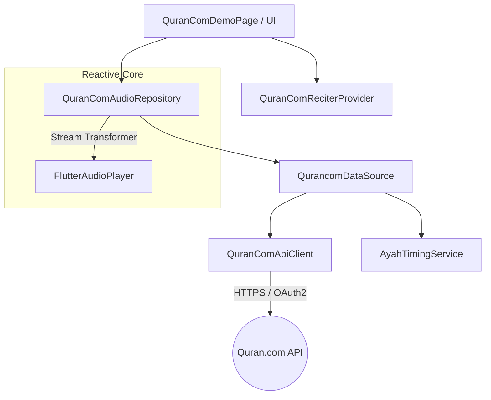

# Quran.com Integration Guide

This document provides a deep technical overview of the Quran.com (Quran Foundation) audio integration within the `imad_flutter` package.

## 🏗️ Architecture Overview

The integration follows the library's strictly modular Clean Architecture.

### Data Flow Diagram



## 🛠️ Key Components

| Component | Responsibility |
|-----------|----------------|
| **`QuranComApiClient`** | Handles OAuth2 Client Credentials flow, token caching, and low-level HTTP requests to `api.quran.com`. |
| **`QurancomDataSource`** | Orchestrates the "Single-Trip" fetch logic, retrieving both audio URLs and verse timings in parallel. |
| **`AyahTimingService`** | Manages a **Hybrid Priority Hierarchy**: RAM Cache -> Local Assets -> Remote API Fallback. |
| **`QuranComAudioRepository`** | The public facing implementation of `AudioRepository`. Enriches player state with real-time verse metadata. |

## 🚀 Performance Optimizations

### 1. Single-Trip Timing Fetching
To avoid the "114-request anti-pattern", we fetch chapter-level timings precisely when the audio for that chapter is requested. These timings are cached in memory (RAM) and shared across the application instantly.

### 2. Record-Based Memory Efficiency
Verse timings for the entire Quran can reach thousands of entries. We use **Dart Named Records** to store word-level segments:
```dart
// Efficient memory storage for word indices
typedef WordSegment = ({int wordIndex, int startTime, int endTime});
```
This avoids the overhead of object allocation for every single word in the Quran.

### 3. Concurrency Locking
The `QuranComApiClient` uses a `Future` based lock to prevent "Token Stampede". If multiple requests trigger a token refresh simultaneously, only one network call is made, and all callers wait for the same result.

## 🛡️ Error Handling & Robustness

- **Token Recovery (401)**: If a cached token expires prematurely, the client automatically clears the cache and retries the request once.
- **Missing Data Fallback**: If a reciter lacks timing data on the server, the system gracefully disables word-sync highlighting while maintaining full audio playback.
- **Defensive Parsing**: Handle `num` vs `int` inconsistencies from the API to prevent serialization crashes.

## ⚙️ Environment Management

The integration supports two environments defined in `QuranComEnv`:
- `production`: The stable Quran.com API.
- `prelive`: The staging environment for testing new features.

---
*For development history and phase-by-phase details, see the [Development Log](QURAN_COM_DEVELOPMENT_LOG.md).*
